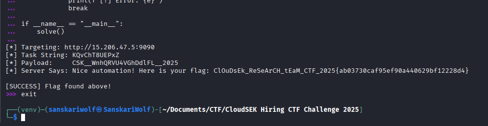

Everything is to be done as it is being said in the webpage
/task to get the task /submit to submit the answer to that task.
If the answer is correct, flag will be given by the server

I used LLM for creating the script using python

```
import requests
import base64
import re

BASE_URL = "http://15.206.47.5:9090"
TASK_URL = f"{BASE_URL}/task"
SUBMIT_URL = f"{BASE_URL}/submit"

def solve():
    print(f"[*] Targeting: {BASE_URL}")
    
    while True:
        session = requests.Session()
        
        try:
            response = session.get(TASK_URL)
            if response.status_code != 200:
                print(f"[-] Failed to fetch task. Status: {response.status_code}")
                continue
            
            raw_html = response.text
            clean_text = re.sub('<[^<]+?>', '', raw_html).strip()
            
            if not clean_text:
                print("[-] Received empty text.")
                continue
                
            random_string = clean_text.split()[-1]
            print(f"[*] Task String: {random_string}")
            
            reversed_str = random_string[::-1]
            
            b64_bytes = base64.b64encode(reversed_str.encode('utf-8'))
            b64_str = b64_bytes.decode('utf-8')
            
            final_payload = f"CSK__{b64_str}__2025"
            print(f"[*] Payload:     {final_payload}")
            
            post_response = session.post(SUBMIT_URL, data=final_payload)
            
            result_text = post_response.text
            print(f"[*] Server Says: {result_text}")
            
            if "CSK" in result_text or "flag" in result_text.lower() or "{" in result_text:
                print("\n[SUCCESS] Flag found above!")
                break
                
            if "slow" in result_text.lower():
                print("[-] Too slow. Retrying immediately...\n")
            else:
                print("[-] Unknown response. Retrying...\n")

        except Exception as e:
            print(f"[!] Error: {e}")
            break

if __name__ == "__main__":
    solve()
```


Why use LLM and not personal script?
It's just fast, and also personal script will not contain all edge cases at once but LLM ones contains them. 

The script is just simple combination of regex to clean the data being recieved from the /task & /submit endpoints, request library is obvious to end the requests, base64 is for encoding and decoding of base64 blob as it is meant to be done as per the point in the webpage.





Flag - ```ClOuDsEk_ReSeArCH_tEaM_CTF_2025{ab03730caf95ef90a440629bf12228d4}```