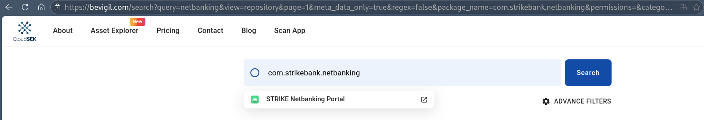
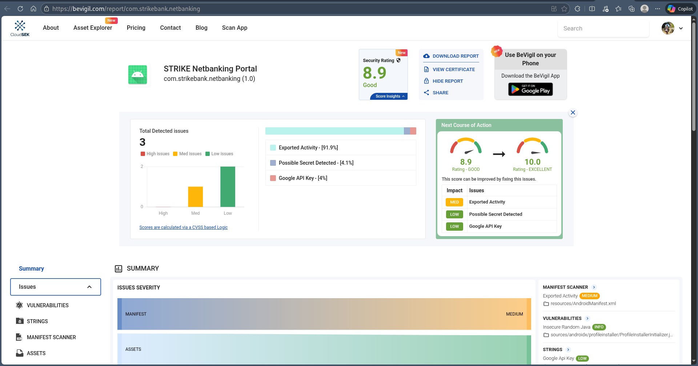
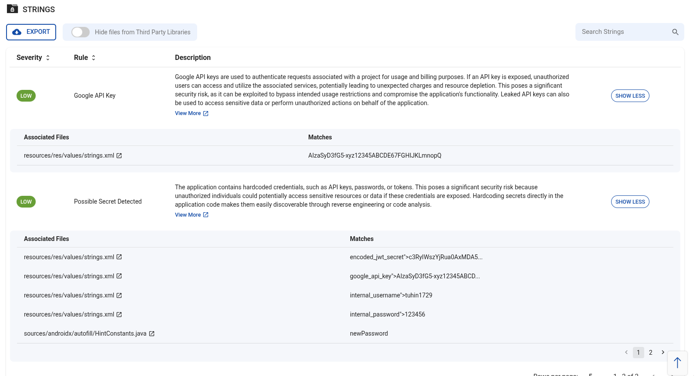
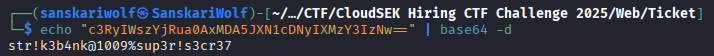
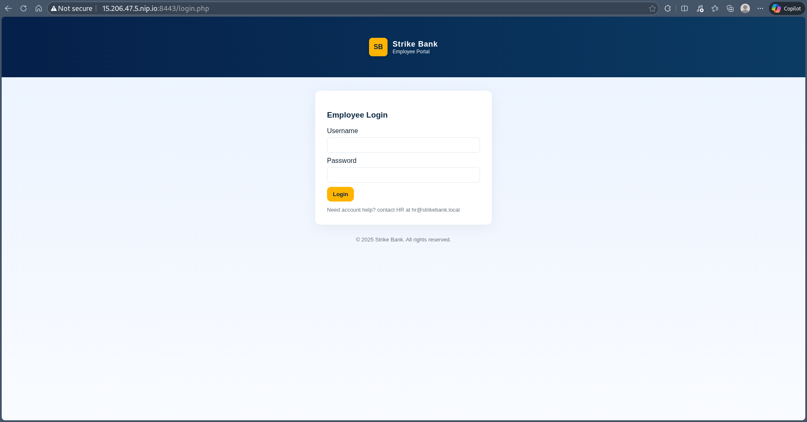
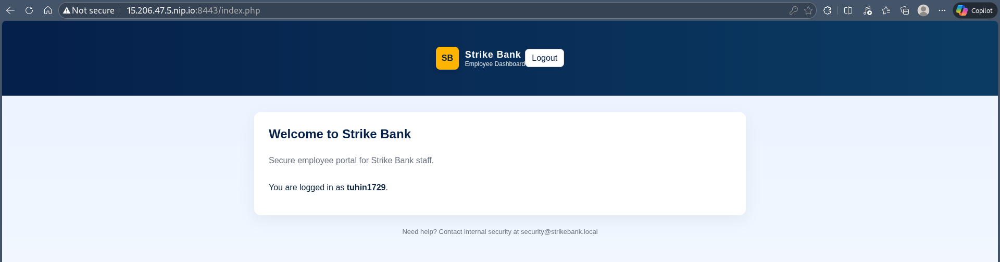
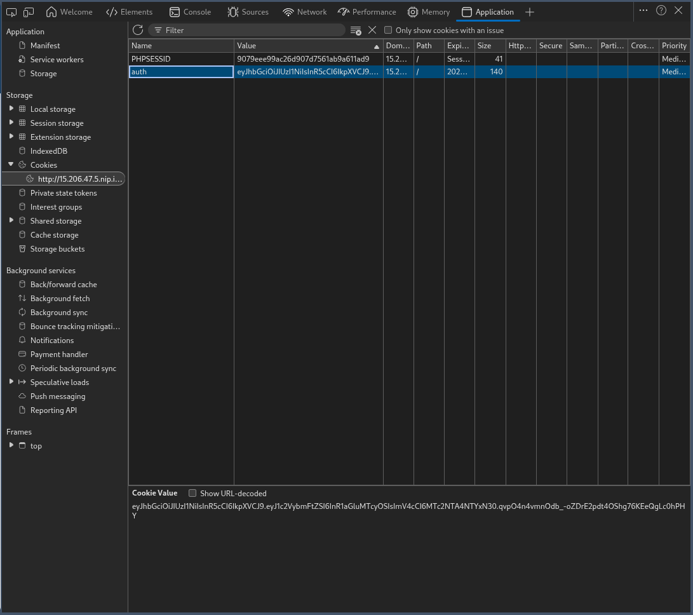
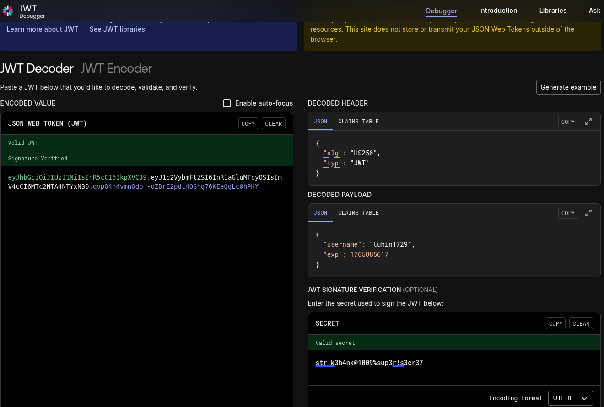
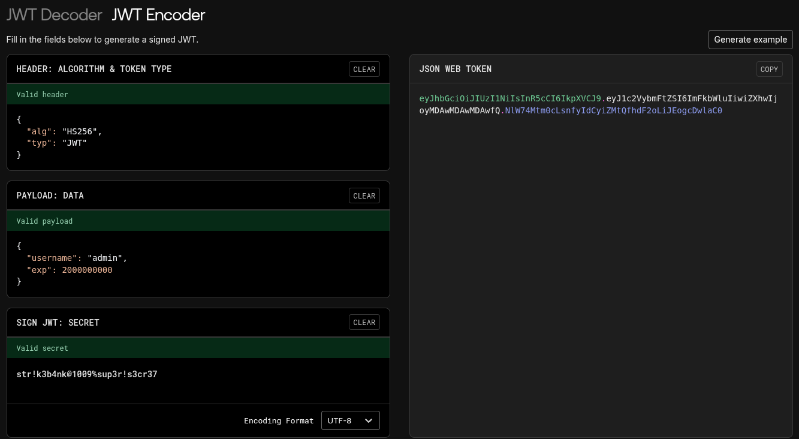
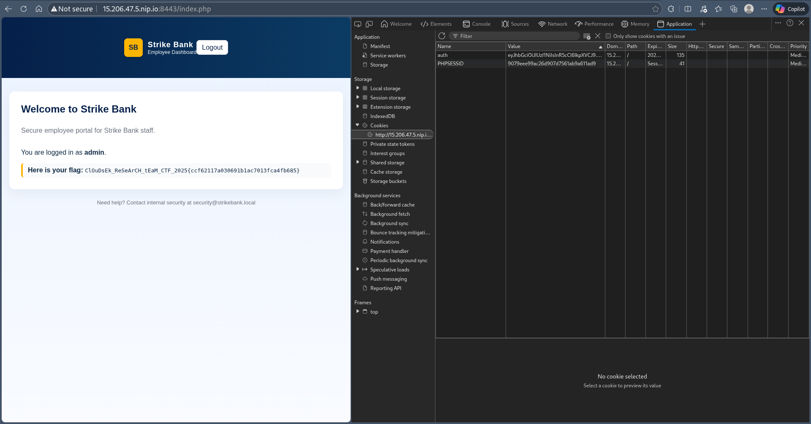

Over the website bevigil.com,
simply enter the package name and hovering over it took me to the security review page





After analyzing everything a little bit, the most porabably path forward seems to be under strings tab



in strings.xml, there are many things present

Portal link
```
    <string name="app_name">STRIKE Netbanking Portal</string>
33	    <string name="base_url">http://15.206.47.5.nip.io:8443/</string>
```

JWT Secret
```
    <string name="encoded_jwt_secret">c3RyIWszYjRua0AxMDA5JXN1cDNyIXMzY3IzNw==</string>
```
thought this is base64 encoded


Then there is this firebase stuff
```
94	    <string name="firebase_database_url">https://strike-projectx-1993.firebaseio.com</string>
95	    <string name="firebase_project_id">strike-projectx-1993</string>
96	    <string name="firebase_sender_id">839498123480</string>
97	    <string name="firebase_storage_bucket">strike-projectx-1993.appspot.com</string>
98	    <string name="google_api_key">AIzaSyD3fG5-xyz12345ABCDE67FGHIJKLmnopQR</string>
```

and how login creds
```
105	    <string name="internal_password">123456</string>
106	    <string name="internal_username">tuhin1729</string>
```


That's all the things required, i went ahead to access the portal though my browser - http://15.206.47.5.nip.io:8443



I logged in from the creds that we got form strings.xml file i.e. tuhin1729:123456



Going through the cookies i found a jwt signed auth cookie for the user tuhin1729, 



so this is case of simple cookie forgery,
In jwt.io, we checked the cookie against the secret that we recieved after decoding the base64 string from strings.xml



Modifying the token username to admin and increasing the time for token expiry, and generating a new token



After putting in the new token in the webpage and refreshing the broswer i got the flag,



Flag - ```ClOuDsEk_ReSeArCH_tEaM_CTF_2025{ccf62117a030691b1ac7013fca4fb685}```